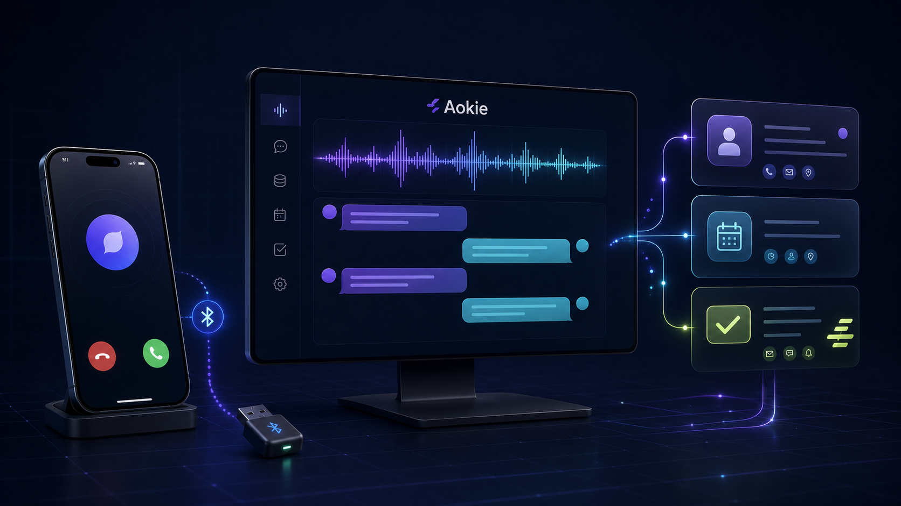
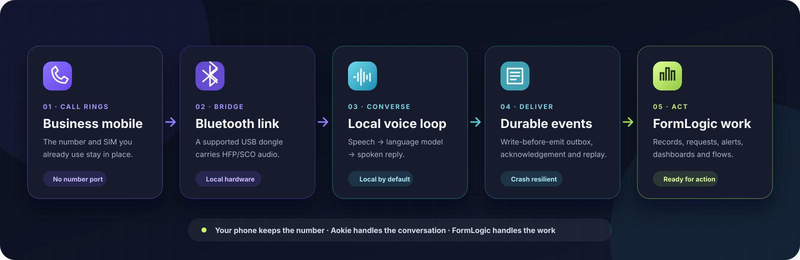
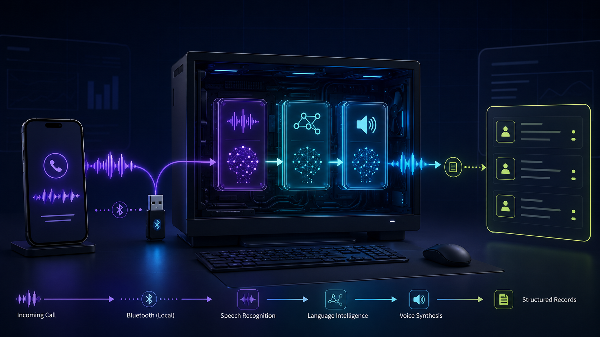
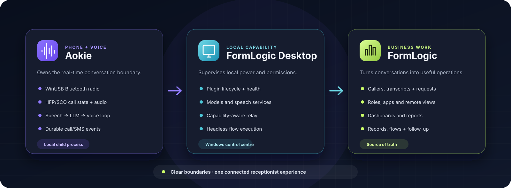

<p align="center">
  
</p>

<h1 align="center">Aokie</h1>

<p align="center"><strong>Your business phone, now with a front desk.</strong></p>

<p align="center">
  Aokie turns a Windows PC, a supported USB Bluetooth adapter and the mobile phone you already use into a local-first AI receptionist. It answers through the phone's native hands-free link, listens, speaks and sends durable call and SMS events into FormLogic—where conversations become records, requests and follow-up work.
</p>

<p align="center">
  
  
  
  
</p>

<p align="center">
  <a href="https://formlogic.com/aokie"><strong>Follow the setup guide</strong></a>
  ·
  <a href="https://formlogic.com/packs/aokie-receptionist"><strong>Explore the Receptionist app</strong></a>
  ·
  <a href="docs/HARDWARE.md"><strong>Supported hardware</strong></a>
  ·
  <a href="docs/ARCHITECTURE.md"><strong>Architecture</strong></a>
</p>

<p align="center"><sub>Product illustration. Aokie is currently a pre-1.0 hardware beta.</sub></p>

---

## A front desk for the phone you already own

Aokie pairs with your mobile like a hands-free car kit. There is no number port, SIP migration or replacement phone system: incoming calls still reach the business mobile, while Aokie supplies the receptionist around it.

> **Your phone keeps the number. Aokie handles the conversation. FormLogic handles the work.**

<p align="center">
  
</p>

When auto-answer is explicitly enabled and the voice runtime is ready:

1. The call arrives on the paired mobile over Bluetooth HFP/SCO.
2. Local speech recognition turns the caller's voice into text.
3. A local OpenAI-compatible language model chooses a short, useful reply.
4. Local text-to-speech plays the reply through the phone.
5. A write-before-emit outbox delivers call, transcript, SMS and hardware events to FormLogic Desktop.
6. FormLogic files the conversation and runs the next business action.

Auto-answer defaults **off**. A known speech-runtime failure keeps the call ringing for an operator instead of deliberately answering into silence.

## Built for real conversations

### Talk naturally

- **Live call control** — answer, reject, hang up, inspect the current call or speak as the operator.
- **Sentence-streamed replies** — Aokie can begin speaking before the model has completed the whole response.
- **Optional barge-in** — acoustic echo cancellation helps callers interrupt without Aokie transcribing its own voice.
- **Better number capture** — digit-aware continuation logic avoids replying halfway through a phone number.
- **Truthful transcripts** — interrupted or failed replies record only the speech that actually played.
- **Clean endings** — an optional agent setting lets Aokie say goodbye and end a completed call.

### Make it sound like your business

Configure the receptionist persona, greeting, voice, model, barge-in behaviour, business instructions and AI/speech endpoints from FormLogic. The shared persona and settings contracts are versioned across both repositories so the plugin and app cannot silently drift apart.

### Keep people in control

- Auto-answer is opt-in.
- Call controls remain available from the FormLogic live console.
- Appointment requests are captured for staff—or an intentionally configured flow—to confirm.
- Incoming SMS events can become records and reply drafts for human approval.
- Hardware health and recovery guidance surface through FormLogic Desktop.

## Calls become structured work

Aokie owns the phone and voice loop. The **Aokie Receptionist** FormLogic pack supplies the business-facing records, dashboards, roles and flows around it.

| Phone event | FormLogic outcome |
|---|---|
| Incoming call | Create a call record and look up a returning caller |
| Caller turn | Store a transcript turn and prepare the next spoken reply |
| Call ended | Finalise the outcome and run summary/follow-up logic |
| Appointment request | Create a requested appointment for staff confirmation |
| Order or message | Create the relevant structured business record |
| Missed call | Raise a callback or follow-up task |
| Incoming SMS | Store the message and optionally prepare a human-approved reply |
| Hardware problem | Surface an operator alert with concrete recovery guidance |

Nothing is locked inside a call log. Once the event reaches FormLogic, the same information can power a role-aware app, dashboard, report, API integration or visual flow.

---

## Local-first by design

<p align="center">
  
</p>

<p align="center"><sub>Product illustration of the default local path.</sub></p>

The default voice path keeps the latency-sensitive conversation on the operator's Windows machine:

| Stage | Default runtime |
|---|---|
| Speech recognition | Parakeet ONNX |
| Language model | Local OpenAI-compatible server, normally llama.cpp or Ollama |
| Voice synthesis | pocket-tts ONNX |
| Speech service | Loopback-only OpenAI-compatible service on `127.0.0.1:17920` |

Running locally avoids metered model inference and keeps the real-time voice loop under the operator's control. Structured events are then delivered through FormLogic Desktop to the FormLogic deployment you choose.

> [!IMPORTANT]
> Aokie can use explicitly configured remote AI, speech-to-text or text-to-speech endpoints. When it does, that provider receives the audio or text required for the selected operation. “Local-first” does not mean every possible configuration is fully offline.

## One system, clear responsibilities

<p align="center">
  
</p>

| Layer | Responsibility |
|---|---|
| **Aokie** | Bluetooth radio, HFP/SCO call audio, MAP events, voice loop, call state and durable event delivery |
| **FormLogic Desktop** | Plugin supervision, local models and services, hardware permissions and headless flow execution |
| **FormLogic** | Receptionist settings, business records, roles, dashboards, reports, flows and remote visibility |

Aokie is deliberately a plugin, not a second platform. It owns the radio and conversation boundary; FormLogic owns the operational experience around it.

---

## What you need

| Component | Current requirement |
|---|---|
| Operating system | Windows 10 or 11, x64 |
| Memory | 16 GB recommended |
| GPU | Around 8 GB VRAM for the comfortable default model path; smaller models can run on lighter hardware |
| Storage | Roughly 4–8 GB for the default model set |
| Phone | A mainstream Android or iOS handset; HFP/MAP/PBAP behaviour varies by OS and firmware |
| Bluetooth | A supported **external USB** adapter driven directly through WinUSB |
| Platform | FormLogic Desktop plus a FormLogic account or self-hosted deployment |

Use a separate USB dongle for Aokie. The guarded installer refuses hubs, composite devices, denied USB classes and unknown adapters by default; it should not take over the computer's normal internal Bluetooth/Wi-Fi combo hardware.

### Supported Bluetooth adapters

| Chipset | USB ID | Tier | Current meaning |
|---|---|---|---|
| Broadcom BCM20702 | `0a5c:21e8` | **Certified** | Full answer / hear / speak / SMS path exercised end to end |
| Broadcom BCM20702 | `0a5c:21ec` | **Certified** | Variant of the certified BCM20702 path |
| Realtek RTL8761 | `0bda:8771` | Beta | Enumerates and pairs; SCO behaviour can vary by firmware |
| Realtek RTL8821CE | `0bda:c822` | Beta | Catalogued chipset; use only an eligible external USB device |
| CSR CSR8510 A10 | `0a12:0001` | Beta | Enumerates and pairs; SCO behaviour can vary by firmware |

Anything outside the catalog is unsupported by default. Mainstream Android and iOS builds have been exercised, but there is not yet a certified phone matrix.

## Set it up

1. Install [FormLogic Desktop](https://formlogic.com/download) on Windows.
2. Install the Aokie plugin and the local speech/model assets.
3. Connect a supported external USB dongle and run the guarded WinUSB setup.
4. Open a bounded pairing window and pair the business mobile.
5. Install the **Aokie Receptionist** pack in FormLogic.
6. Link Desktop to FormLogic through OAuth.
7. Configure the business name, greeting, persona, voice, model and instructions.
8. Make a test call, inspect the transcript and records, then explicitly enable auto-answer if desired.

The public [Aokie setup guide](https://formlogic.com/aokie) covers hardware, model sizes, driver setup, pairing, configuration and the first live call.

## Reliability and privacy

| Control | What it does |
|---|---|
| Immutable call IDs + generation stamps | Prevent delayed speech results from one call crossing into another |
| Write-before-emit SQLite outbox | Stores essential events before delivery, then retries until acknowledged or dead-lettered |
| Idempotency collision checks | Refuse same-key/different-content events instead of hiding a derivation bug |
| Transcript truth rules | Record only speech that was actually played, with interruption/error annotations |
| Voice readiness health | Suppress auto-answer after a known STT/TTS runtime failure |
| DPAPI protection | Protect newly written transcript/SMS outbox payloads on the normal Windows path |
| Redacted logging | Exclude conversation content unless `AOKIE_LOG_CONTENT=1` is deliberately set |
| Endpoint validation | Disable redirects and classify, resolve and pin configured speech/AI destinations |
| Guarded driver helper | Validate device intent, target identity, helper hash and INF hash across elevation |
| Driver recovery | Restore an eligible dongle to the normal Windows Bluetooth driver and remove development certificates |

The local speech service binds to loopback, rejects browser-origin requests and bounds request sizes/concurrency. The plugin inherits an allow-listed environment rather than the Desktop host's full secret set.

DPAPI is the normal Windows protection path. If that protection fails, Aokie surfaces the condition and preserves the event rather than silently discarding it; do not treat this as an unconditional encrypted-at-rest guarantee for every failure mode or legacy row.

> [!NOTE]
> Call recording, disclosure and AI-consent rules vary by jurisdiction. Aokie exposes versioned consent infrastructure, but the operator remains responsible for appropriate wording, configuration and legal review.

<details>
<summary><strong>Current hardware-beta boundaries</strong></summary>

- Aokie is pre-1.0: Windows is the shipping target; Linux/libusb is experimental, and uncatalogued external USB Bluetooth hardware is managed-beta only.
- Phone behaviour varies by OS and firmware; there is not yet a certified handset matrix.
- Auto-answer and optional barge-in default off.
- The plugin can receive/send SMS events, but it should not yet be marketed as a complete mirrored phone inbox.
- The production consent wizard, jurisdiction-specific wording, signature verification and hard-enforcement rollout are still being completed.
- A measured bidirectional audio-loopback self-test and prerecorded fail-safe answer path remain planned.
- Windows release artifacts may trigger SmartScreen until production code signing is configured.
- Local processing is the default path, not an unconditional privacy promise for remote-endpoint configurations.

</details>

---

## Build from source

Aokie's radio runtime uses WinUSB on Windows and libusb on Linux. The managed
beta can probe an uncatalogued, external USB Bluetooth HCI controller after an
explicit operator opt-in; "any dongle" is a compatibility goal rather than a
guarantee because controller firmware, endpoint layouts and SCO support vary.

### Test gates

```bash
cargo test --workspace
cargo check -p aokie-plugin --features voice
cargo clippy --workspace --all-targets
cargo audit
```

Always test both the default plugin surface and the `voice` feature. Deny-level Clippy findings and new RustSec advisories block CI.

### Release build

Build the elevated driver helper first, pin its final SHA-256 into the plugin, then build the voice-enabled plugin:

```powershell
$env:AOKIE_EXPECTED_HELPER_SHA256 = 'helper-build-placeholder'
cargo build -p aokie-dongle --bin aokie-driver-helper --release
$env:AOKIE_EXPECTED_HELPER_SHA256 = (Get-FileHash target/release/aokie-driver-helper.exe -Algorithm SHA256).Hash.ToLower()
cargo build -p aokie-plugin --features voice --release
```

The placeholder is used only while compiling the helper itself; the helper never dispatches an elevation request. A production helper also requires `AOKIE_EXPECTED_DRIVER_INF_SHA256` and `AOKIE_EXPECTED_DRIVER_CAT_SHA256` for the exact Microsoft-signed driver pair. Sign the helper before calculating its final hash, then build the plugin with that post-sign hash. The release voice bundle also needs ONNX Runtime, the Parakeet assets and the pocket-tts assets in the expected model directories.

### Managed-beta driver build

For administrator-managed pilots without a Microsoft-signed catalog, build the
distinct managed-beta flavour. It keeps the helper hash pin and privileged
target checks, but permits the helper's trusted per-device INF renderer and a
locally generated catalog certificate:

```powershell
$env:AOKIE_EXPECTED_HELPER_SHA256 = 'helper-build-placeholder'
cargo build -p aokie-dongle --bin aokie-driver-helper --features managed-beta-driver --release
$env:AOKIE_EXPECTED_HELPER_SHA256 = (Get-FileHash target/release/aokie-driver-helper.exe -Algorithm SHA256).Hash.ToLower()
cargo build -p aokie-plugin --features voice,managed-beta-driver --release
```

The installed app must also receive `AOKIE_ALLOW_SELF_SIGNED_DRIVER=1`; the
compile-time feature alone never authorises trust-store changes. To try an
uncatalogued external dongle, additionally set:

```powershell
$env:AOKIE_INSTALL_UNKNOWN_DONGLE = 'YES_I_REBIND_AT_MY_OWN_RISK'
```

Unknown-device mode still refuses absent devices, hubs, composite/internal
radios and non-Bluetooth device classes. Use **Restore driver** before returning
the dongle to the operating system's normal Bluetooth stack.

## Workspace map

| Crate | Responsibility |
|---|---|
| `aokie-plugin` | FormLogic Desktop plugin process, JSON-RPC connector, call state, voice agent and durable outbox |
| `aokie-bluetooth` | WinUSB HCI/ACL/SCO runtime, HFP, audio codecs, MAP/PBAP protocol support and recovery |
| `aokie-dongle` | Dongle discovery, guarded driver installation, restoration and event mapping |
| `aokie-ai` | Local ONNX speech-to-text and text-to-speech runtimes |
| `aokie-voice-server` | Loopback OpenAI-compatible STT/TTS service |
| `aokie-core` | Tauri-free shared policy, catalog, contracts, security and native logic |
| `aokie-audio`, `aokie-db` | Shared audio and storage infrastructure |
| `aokie-receptionist` | Reserved shared receptionist crate surface; the active business UI and workflows live in FormLogic |

The plugin speaks JSON-RPC 2.0 over newline-delimited stdio. Its events, commands, errors, settings schema and default persona are frozen in `docs/contracts/*.json`, with test-locked copies in the FormLogic repository.

## Documentation

| Guide | What it covers |
|---|---|
| [Architecture](docs/ARCHITECTURE.md) | Process shape, call state, voice pipeline, durability and invariants |
| [Supported hardware](docs/HARDWARE.md) | Dongle catalog, compatibility tiers, phone notes and Windows timing |
| [FormLogic plugin contract](docs/FORMLOGIC_PLUGIN_CONTRACT.md) | Cross-repository commands, events, manifests and obligations |
| [Security policy](SECURITY.md) | Supported versions, security boundaries and private reporting |
| [FormLogic Aokie operations](https://github.com/f2i-com/formlogic.com/blob/main/docs/AOKIE_OPERATIONS.md) | Stack supervision, deployment, diagnostics, retention and event recovery |
| [FormLogic troubleshooting](https://github.com/f2i-com/formlogic.com/blob/main/docs/AOKIE_TROUBLESHOOTING.md) | Concrete call, audio, flow and hardware failures |

## Security reporting

Please report suspected vulnerabilities privately to **the@lance.name** with `SECURITY` in the subject. Do not open a public issue for a security report.

## License

Aokie is **proprietary software** (`LicenseRef-Proprietary`) and is not open source. The workspace is pre-1.0 and is not published to crates.io. Contact FormLogic for licensing terms.

FormLogic is maintained separately in [f2i-com/formlogic.com](https://github.com/f2i-com/formlogic.com).

---

<p align="center">
  <strong>Your phone line. Your local AI. Your FormLogic workflows.</strong>
</p>

<p align="center">
  <a href="https://formlogic.com/aokie">Aokie setup guide</a>
  ·
  <a href="https://formlogic.com/">FormLogic</a>
  ·
  <a href="mailto:hello@formlogic.com">hello@formlogic.com</a>
</p>
