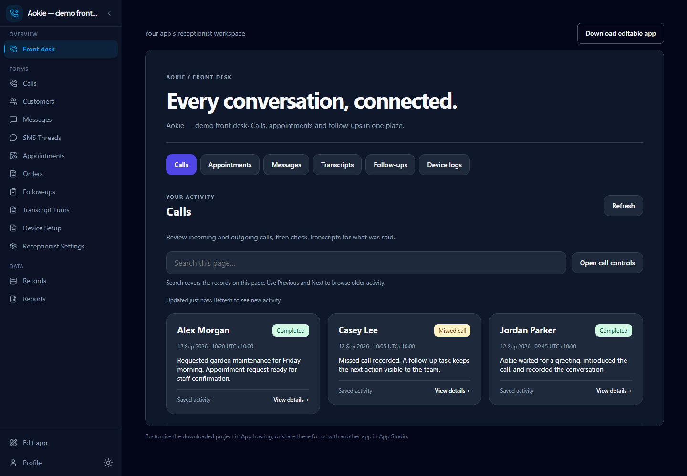
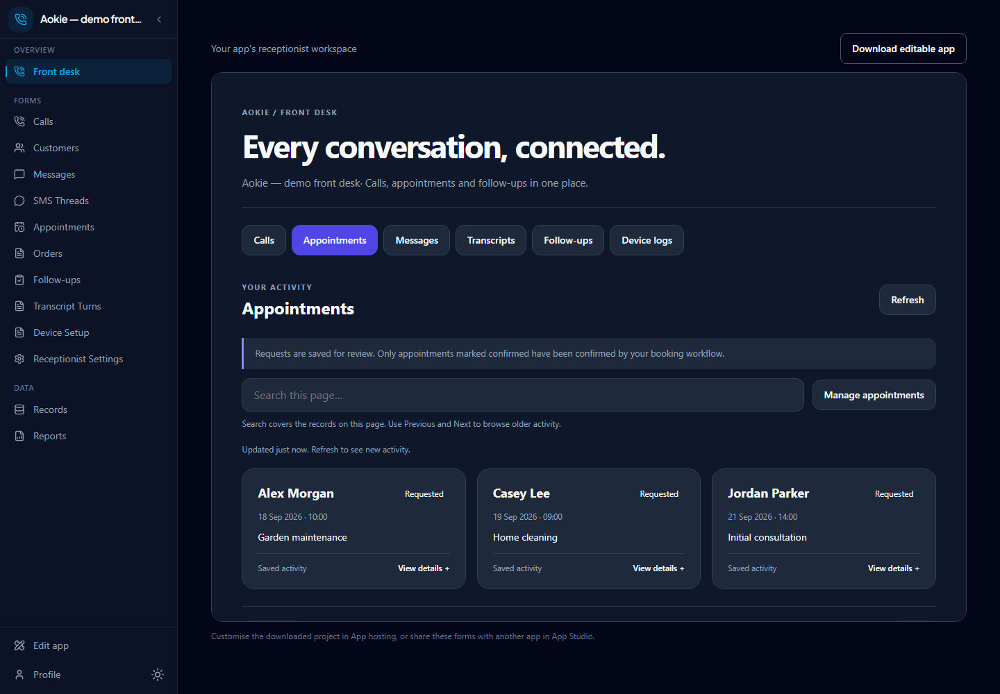
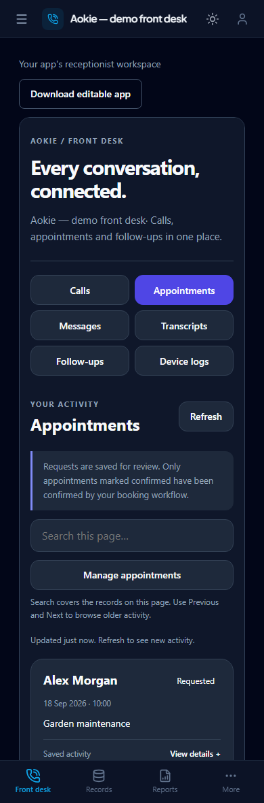
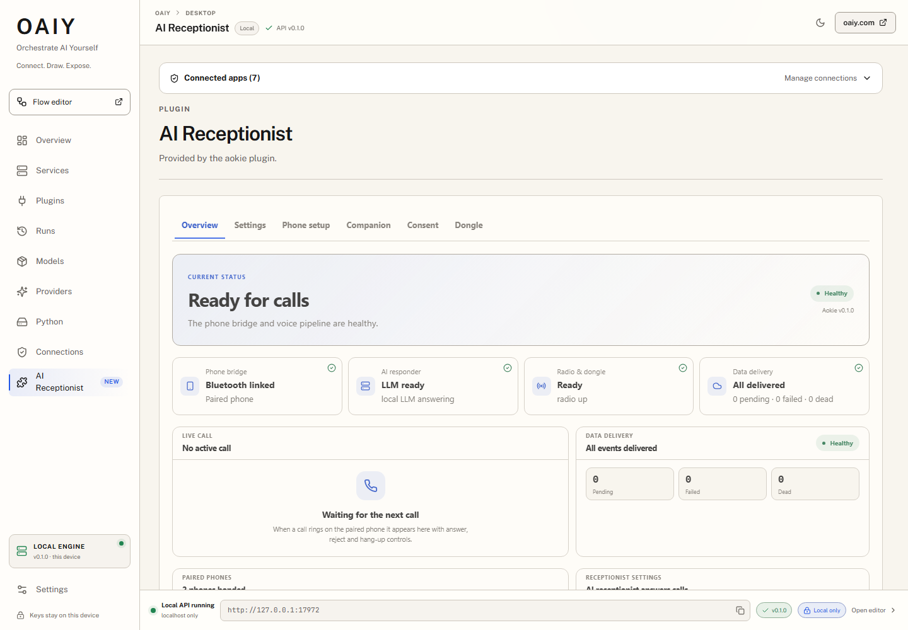

<h1 align="center">Aokie</h1>

<p align="center"><strong>Your phone. A local AI receptionist. An editable front desk.</strong></p>

<p align="center">
  <a href="https://formlogic.com/aokie">Setup guide</a> ·
  <a href="https://formlogic.com/packs/aokie-receptionist">Receptionist app</a> ·
  <a href="docs/HARDWARE.md">Supported hardware</a> ·
  <a href="#build-from-source">Build from source</a>
</p>

Aokie connects a supported Bluetooth USB adapter and your existing mobile phone to a Windows PC. It handles incoming and outgoing conversations through **OAIY**, then sends calls, messages, transcripts and appointment requests into **FormLogic**. The front desk is a **Softn app**: use it as supplied, download its source, or integrate its forms into another app.

<p align="center">
  
  <br /><sub>Actual hosted Aokie interface, September 2026. Names and records are fictional browser-only demo data.</sub>
</p>

**Hardware beta · Windows 10/11 x64 · Bring your own AI · Auto-answer is opt-in**

## One connected front desk

| Part | What it does |
|---|---|
| **Aokie phone bridge** | Owns Bluetooth call audio, SMS, the voice conversation and a durable event outbox. |
| **OAIY Desktop** | Runs the plugin, supervises local services, connects AI providers and executes connected flows. |
| **FormLogic** | Hosts the app, applies permissions, stores records and runs backend logic around each conversation. |
| **Softn app** | Provides the editable front desk UI and logic, connected to FormLogic through the host session. |

Your phone keeps its number. There is no number port or SIP migration. Calls still arrive on the mobile; Aokie supplies the conversation and FormLogic supplies the business workflow.

## Conversations that keep moving

- **Incoming and outbound calls.** Answer, reject or end a call from the console. An Aokie-initiated outbound call waits for the recipient to speak before introducing itself.
- **Interruptions and overlap.** With barge-in enabled, Aokie keeps capturing caller speech while it talks and can yield to a correction. Echo cancellation and speech pre-roll help preserve quiet words.
- **Useful transcripts.** Caller and assistant turns are stored with overlap, correction and interrupted-reply labels. The live console keeps a bounded view; the connected app holds the durable records.
- **Appointment requests.** Collect the caller's name, service, date, time and agreement, then queue a validated request for the connected flow. A request is not a confirmed booking.
- **SMS and follow-ups.** Receive messages, prepare AI reply drafts for approval and send approved texts. Configured flows can create missed-call callback tasks and outbound attempts.
- **Visible call waiting.** The console shows waiting and held callers, plus whether a caller switch is still being confirmed by the phone. Carrier and handset support matter.

The normal conversation uses the plugin's voice loop. FormLogic flows handle business work such as recording an appointment, summarising a call or preparing a follow-up; they do not need to generate a second reply over the live AI.

## The app belongs in your workflow

The front desk brings **Calls, Appointments, Messages, Transcripts, Follow-ups and Device logs** together. Search the current page, browse older records, open details and jump into the full tool for a record type. The same interface adapts to mobile screens.

<p align="center">
  
  <br /><sub>Actual appointment view with fictional demo requests. Requested and confirmed appointments remain distinct.</sub>
</p>

| Start with Aokie | Add Aokie to an existing app |
|---|---|
| Install the **Aokie Receptionist** starter in FormLogic. | Use App Studio's app composition to share the Aokie forms into the destination app. |
| Connect OAIY and configure the receptionist settings and flows. | Keep the existing app's home and navigation, and add the front desk where it fits. |
| Use **Download editable app** to get the Softn project. | Shared forms keep their records and permissions. Review automation bindings separately. |

The editable project contains `.ui` and `.logic` source plus the FormLogic connection declaration. Authentication stays in the host session; the export does not embed that session's credentials. The template lives in the [Softn Aokie workspace](https://github.com/f2i-com/softn.com/tree/main/examples/aokie-workspace), while the connected starter and business flows live in [FormLogic](https://github.com/f2i-com/formlogic.com).

<p align="center">
  
  <br /><sub>The same hosted app at phone width, using the same fictional demo records.</sub>
</p>

## See what is connected in OAIY

<p align="center">
  
  <br /><sub>Actual locally running OAIY and Aokie console, September 2026. No call content, phone numbers or Bluetooth addresses are shown.</sub>
</p>

The Overview reports plugin health, phone connection, AI readiness, delivery backlog and live call state. Phone setup guides pairing, Settings selects the voice and AI endpoints, and Consent controls the allowed data use. Failed health checks show the problem instead of leaving the screen on “Starting”. Provider selections use the connected OAIY gateway address, including a custom local port.

Messages marked **sent** mean the phone accepted the send operation; that status is not a carrier delivery receipt. Drafts remain marked **Needs approval** until the configured approval step is completed.

## Bring your own AI

The voice pipeline can run locally or use endpoints you explicitly configure:

| Stage | Current local test configuration |
|---|---|
| Language model | Qwen3.5-9B GGUF, Q4, through a local OpenAI-compatible server |
| Speech recognition | NVIDIA Parakeet through a local ONNX speech service |
| Speech synthesis | Pocket TTS through a local speech service |
| Runtime and routing | OAIY Desktop, with local services or configured provider profiles |

These are tested choices, not required model purchases. Hardware requirements depend on the selected models and inference runtimes. A GPU can accelerate supported engines; selecting a local endpoint alone does not guarantee GPU execution. Remote providers receive the text or audio required by the enabled operation.

## Set it up

1. **Prepare Windows and a supported external USB Bluetooth adapter.** Check the [hardware guide](docs/HARDWARE.md) before changing a driver. The supported voice path uses the WinUSB dongle transport.
2. **Run [OAIY Desktop](https://github.com/f2i-com/oaiy.com)** and install the Aokie plugin package. For a source build, see the instructions below.
3. **Configure the AI and speech services.** Start the selected local services or connect a provider, then select the corresponding endpoints in Aokie Settings.
4. **Pair the business mobile.** Open Phone setup, start pairing and confirm matching codes. Check that both the Bluetooth link and voice pipeline become ready.
5. **Install the Aokie Receptionist starter in FormLogic.** Connect OAIY to the intended FormLogic app and review the app's receptionist settings and flow bindings.
6. **Test the whole path.** Make a test call, check the transcript, submit a fictional appointment request and verify its record in the app. Test messaging only with a number you control.
7. **Enable the behaviour you want.** Auto-answer, outbound calling, messaging and interruption settings are explicit choices. Start with manual calls, then enable automation after reviewing its flow and result.

Keep OAIY running on the computer attached to the phone. FormLogic supplies the hosted app and records; the local computer supplies the phone connection and any local AI services.

## What has been checked

The current local integration has exercised incoming and outbound calls with a Pixel 9a and a Broadcom USB adapter, including recipient-first greetings, interruptions, transcript delivery, sending a test SMS and receiving its reply. Local LLM-driven booking tests also exercised validated appointment requests reaching the connected app. The screenshots above show the current implementation, not a proposed mockup.

Remaining limits are explicit:

- Hardware and mobile-network behaviour varies. End-to-end carrier call waiting/hold and automatic missed-call callbacks still need additional live validation; code tests alone do not prove those paths on every phone.
- Appointment requests require staff or an intentionally configured backend to confirm them. A model-generated readback is not confirmation.
- OAIY's current provider gateway does not expose the realtime WebSocket voice route; the working local path uses separate LLM, STT and TTS services.
- Aokie is pre-1.0. Release packaging, code signing and supported hardware should be checked before a wider rollout. See [hardware compatibility](docs/HARDWARE.md) and [security boundaries](SECURITY.md).

Essential events use a write-before-emit SQLite outbox. Call IDs and generation stamps fence delayed work to its original conversation, while idempotency protects the connected records from duplicate delivery. See [Architecture](docs/ARCHITECTURE.md) for the detailed runtime and recovery rules.

---

## Build from source

Aokie's radio runtime uses WinUSB on Windows and libusb on Linux. The managed
beta can probe an uncatalogued, external USB Bluetooth HCI controller after an
explicit operator opt-in; "any dongle" is a compatibility goal rather than a
guarantee because controller firmware, endpoint layouts and SCO support vary.

### Test gates

```bash
cargo test --workspace
cargo check -p aokie-plugin --features voice
cargo test -p aokie-plugin --features voice -- --test-threads=2
node scripts/check-receptionist-ui.mjs
cargo test -p aokie-protocol -p aokie-mobile
(cd apps/aokie-mobile && npm ci && npm test && npm run build)
cargo clippy --workspace --all-targets
cargo audit
```

Run checks manually against both the default plugin surface and the `voice` feature. Automatic CI is temporarily paused; the CI and self-host smoke workflows remain available through GitHub Actions **Run workflow**. Review deny-level Clippy findings and RustSec advisories before releasing.

### Release build

Build the elevated driver helper first, pin its final SHA-256 into the plugin, then build the voice-enabled plugin:

```powershell
$env:AOKIE_EXPECTED_HELPER_SHA256 = 'helper-build-placeholder'
cargo build -p aokie-dongle --bin aokie-driver-helper --release
$env:AOKIE_EXPECTED_HELPER_SHA256 = (Get-FileHash target/release/aokie-driver-helper.exe -Algorithm SHA256).Hash.ToLower()
cargo build -p aokie-plugin --features voice --release
```

The placeholder is used only while compiling the helper itself; the helper never dispatches an elevation request. A production helper also requires `AOKIE_EXPECTED_DRIVER_INF_SHA256` and `AOKIE_EXPECTED_DRIVER_CAT_SHA256` for the exact Microsoft-signed driver pair. Sign the helper before calculating its final hash, then build the plugin with that post-sign hash. The release voice bundle also needs ONNX Runtime, the Parakeet assets and the pocket-tts assets in the expected model directories.

### Managed-beta driver build

For administrator-managed pilots without a Microsoft-signed catalog, build the
distinct managed-beta flavour. It keeps the helper hash pin and privileged
target checks, but permits the helper's trusted per-device INF renderer and a
locally generated catalog certificate:

```powershell
$env:AOKIE_EXPECTED_HELPER_SHA256 = 'helper-build-placeholder'
cargo build -p aokie-dongle --bin aokie-driver-helper --features managed-beta-driver --release
$env:AOKIE_EXPECTED_HELPER_SHA256 = (Get-FileHash target/release/aokie-driver-helper.exe -Algorithm SHA256).Hash.ToLower()
cargo build -p aokie-plugin --features voice,managed-beta-driver --release
```

The installed app must also receive `AOKIE_ALLOW_SELF_SIGNED_DRIVER=1`; the
compile-time feature alone never authorises trust-store changes. To try an
uncatalogued external dongle, additionally set:

```powershell
$env:AOKIE_INSTALL_UNKNOWN_DONGLE = 'YES_I_REBIND_AT_MY_OWN_RISK'
```

Unknown-device mode still refuses absent devices, hubs, composite/internal
radios and non-Bluetooth device classes. Use **Restore driver** before returning
the dongle to the operating system's normal Bluetooth stack.

## Workspace map

| Crate | Responsibility |
|---|---|
| `aokie-plugin` | OAIY Desktop plugin process, JSON-RPC connector, call state, voice agent and durable outbox |
| `aokie-protocol` | Canonical Companion snapshot/command models, revision fences and cross-language fixtures |
| `aokie-realtime` | Self-hostable authenticated Companion WSS gateway, bounded replay and Desktop/mobile routing |
| `aokie-bluetooth` | WinUSB HCI/ACL/SCO runtime, HFP, audio codecs, MAP/PBAP protocol support and recovery |
| `aokie-dongle` | Dongle discovery, guarded driver installation, restoration and event mapping |
| `aokie-ai` | Local ONNX speech-to-text and text-to-speech runtimes |
| `aokie-voice-server` | Loopback OpenAI-compatible STT/TTS service |
| `aokie-core` | Tauri-free shared policy, catalog, contracts, security and native logic |
| `aokie-audio`, `aokie-db` | Shared audio and storage infrastructure |
| `aokie-receptionist` | Reserved shared receptionist crate surface; the active business UI and workflows live in FormLogic |
| `apps/aokie-mobile` | Aokie Companion Tauri v2 shell, realtime client, safety state, demo and native integration seams |

The plugin speaks JSON-RPC 2.0 over newline-delimited stdio. Its events, commands, errors, settings schema and default persona are frozen in `docs/contracts/*.json`, with test-locked copies in the FormLogic repository.

## Documentation

| Guide | What it covers |
|---|---|
| [Architecture](docs/ARCHITECTURE.md) | Process shape, call state, voice pipeline, durability and invariants |
| [Supported hardware](docs/HARDWARE.md) | Dongle catalog, compatibility tiers, phone notes and Windows timing |
| [FormLogic plugin contract](docs/FORMLOGIC_PLUGIN_CONTRACT.md) | Cross-repository commands, events, manifests and obligations |
| [Aokie Companion](apps/aokie-mobile/README.md) | Mobile shell, current capabilities, security boundaries and local builds |
| [Security policy](SECURITY.md) | Supported versions, security boundaries and private reporting |
| [FormLogic Aokie operations](https://github.com/f2i-com/formlogic.com/blob/main/docs/AOKIE_OPERATIONS.md) | Stack supervision, deployment, diagnostics, retention and event recovery |
| [FormLogic troubleshooting](https://github.com/f2i-com/formlogic.com/blob/main/docs/AOKIE_TROUBLESHOOTING.md) | Concrete call, audio, flow and hardware failures |

## Security reporting

Please report suspected vulnerabilities privately to **the@lance.name** with `SECURITY` in the subject. Do not open a public issue for a security report.

## License

Aokie is **proprietary software** (`LicenseRef-Proprietary`) and is not open source. The workspace is pre-1.0 and is not published to crates.io. Contact FormLogic for licensing terms.

FormLogic is maintained separately in [f2i-com/formlogic.com](https://github.com/f2i-com/formlogic.com).

---

<p align="center">
  <strong>Your phone line. Your local AI. Your FormLogic workflows.</strong>
</p>

<p align="center">
  <a href="https://formlogic.com/aokie">Aokie setup guide</a>
  ·
  <a href="https://formlogic.com/">FormLogic</a>
  ·
  <a href="mailto:hello@formlogic.com">hello@formlogic.com</a>
</p>
