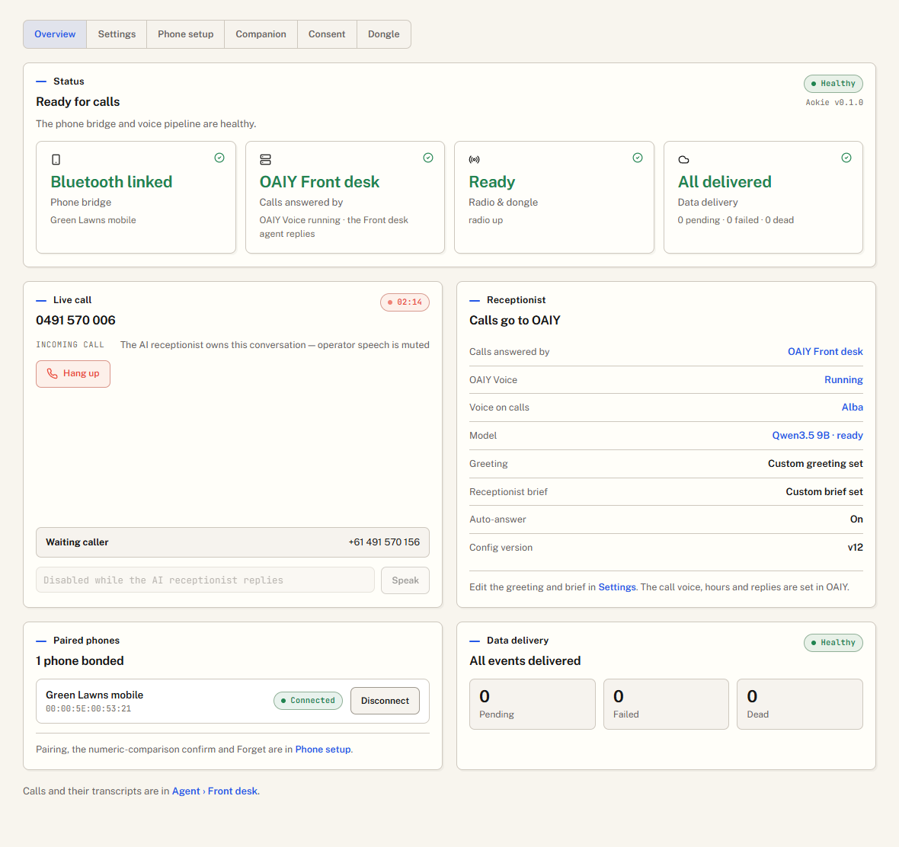
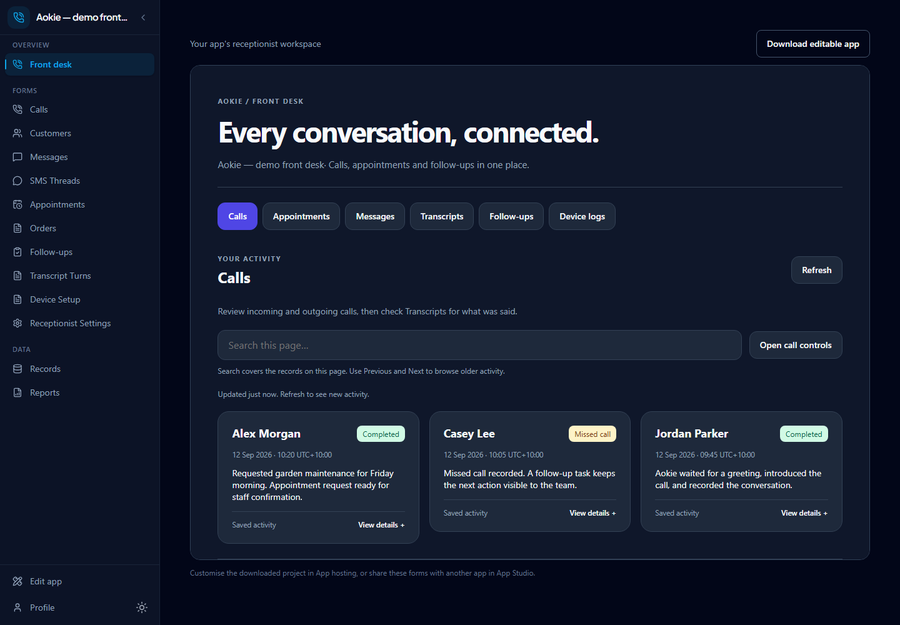
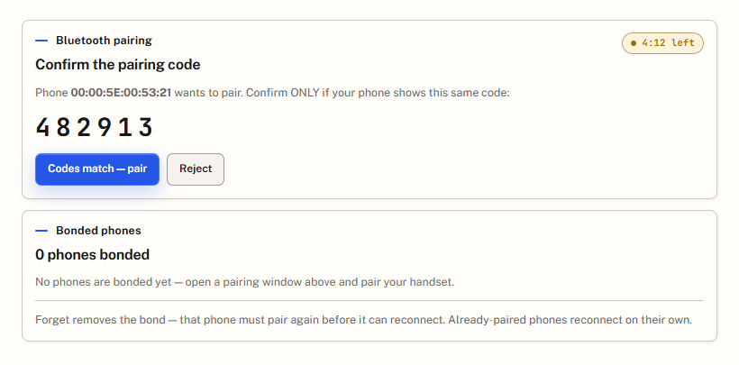

<h1 align="center">Aokie</h1>

<p align="center"><strong>Your phone. A local AI receptionist. An editable front desk.</strong></p>

<p align="center">
  <a href="#install-it-into-oaiy">Install</a> ·
  <a href="docs/HARDWARE.md">Supported hardware</a> ·
  <a href="#build-from-source">Build from source</a> ·
  <a href="docs/README.md">Documentation</a> ·
  <a href="https://formlogic.com/aokie">Setup guide</a>
</p>

Aokie Phone Bridge turns the mobile your business already uses into an AI front desk.
A USB Bluetooth dongle on a Windows PC pairs with the phone; Aokie answers and places
its calls, sends and reads its texts, and reads its contacts. It runs as a plugin
inside **OAIY Desktop** (or FormLogic Desktop), where OAIY's voice and Front desk agent
talk to callers, and it sends every call, text and transcript on to **FormLogic**. The
phone keeps its number: there is nothing to port and no SIP.

<p align="center">
  <picture>
    <source media="(prefers-color-scheme: dark)" srcset="docs/readme-assets/receptionist-overview-dark.png" />
    
  </picture>
  <br /><sub>The receptionist screen, with a live call going to OAIY's Front desk and a second caller waiting. Stub host and fictional data.</sub>
</p>

**Hardware beta · Windows 10/11 x64 · Pre-1.0 · Auto-answer and outbound calls are opt-in**

## What it does

- **Answers and places calls.** Answer, reject and end calls from the screen, or let
  the receptionist pick up by itself. Outbound calls speak a set opening line and wait
  for the other person to talk first, behind an off-by-default switch, quiet hours
  and a daily limit.
- **Hands the conversation to OAIY.** On the OAIY route the call's audio streams to
  OAIY's voice gateway: OAIY Voice hears and speaks, and OAIY's Front desk agent
  answers from your business notes. Aokie's own lines (a screened caller's message,
  hold announcements) are said in the same voice.
- **Keeps the conversation natural.** Callers can interrupt, and the receptionist
  yields; echo cancellation and speech pre-roll keep quiet words. Transcripts keep
  only the part of a reply the caller actually heard, and mark interruptions and
  corrections.
- **Texts and contacts.** Receives and sends SMS over MAP and reads the phone book over
  PBAP. A text marked sent means the phone accepted it, not that the carrier delivered
  it; a send that is refused is reported back as failed, never left queued.
- **Takes appointment requests.** Collects the caller's name, service, date and time,
  and queues a checked request for the connected app. A request is not a confirmed
  booking.
- **Call waiting and hold.** With the settings on, a second caller shows as waiting, the
  switchboard swaps between callers, and an automatic hold queue can juggle them.
  Carrier and handset support matter.
- **Screens callers.** Blocked numbers, callers outside an accept pattern and, if you
  choose, withheld numbers hear a short message and are refused; they never reach the
  agent.
- **Asks first.** The radio stays off until consent is recorded, and each use
  (Bluetooth, contacts, texts, transcription, recording, remote captions) is chosen
  explicitly.
- **Loses nothing.** Every call and text event is written to a local SQLite outbox
  before it is sent, with transcripts and texts encrypted at rest (Windows DPAPI), and
  re-delivered until the host acknowledges it.
- **Lets a person take over.** Aokie Companion, a phone or desktop app, can listen to a
  live call or take it over and hand it back.

### Who talks to the caller

| Route | Who hears, decides and speaks |
|---|---|
| **OAIY** (the setup wizard's last step turns it on) | OAIY Voice hears and speaks; OAIY's Front desk agent answers, with the model loaded in OAIY's Engines. |
| **Aokie's own speech** (the `voice` build) | Parakeet speech recognition and Pocket TTS or sherpa voices inside the plugin, with any OpenAI-compatible language model (tested with Qwen3.5-9B GGUF, Q4, on a local server). |
| **Flows only** | No AI receptionist: your flows, or you through the screen, speak to the caller. |

Model and hardware requirements depend on what you choose. Remote providers receive only
the text or audio the enabled operation needs.

## Supported hardware

- **A PC:** Windows 10 or 11, x64.
- **A USB Bluetooth dongle** bound to the WinUSB driver. Aokie drives it with its own
  Bluetooth stack, and this is the only path that carries call audio: Windows 11 25H2
  no longer lets applications reach Bluetooth call audio. The dongle is dedicated to
  Aokie while it is bound; **Restore driver** gives it back to Windows.
- **The business mobile:** Android or iPhone with Bluetooth hands-free calling (HFP),
  and message access (MAP) and phone book access (PBAP) for texts and contacts. Tested
  most with a Pixel 9a; there is no certified phone list yet.

| Chipset | VID:PID | Tier |
|---|---|---|
| Broadcom BCM20702 | `0a5c:21e8`, `0a5c:21ec` | Certified: answer, hear, speak and SMS run end to end |
| Realtek RTL8761 | `0bda:8771` | Beta: enumerates and pairs; call audio may vary by firmware |
| Realtek RTL8821CE | `0bda:c822` | Beta |
| CSR CSR8510 A10 | `0a12:0001` | Beta |

Read [docs/HARDWARE.md](docs/HARDWARE.md) before changing a driver. It covers the tiers,
the managed-beta path for dongles not in the catalog, Linux, the native Windows
Bluetooth backend (texts, contacts and call control without a driver, but no call
audio), and known phone issues.

**macOS and Linux** are not supported yet, but the same plugin builds for them: there
the dongle is opened through libusb and no driver is installed. It has been built,
tested and run on Linux against a stand-in dongle; it has not been run on a Mac or with
a real dongle off Windows. [docs/HARDWARE.md](docs/HARDWARE.md#macos) says what a Mac
build is, how to try one, and what only a Mac can answer.

## How it fits together

```text
  Business mobile
        │  Bluetooth: calls (HFP/SCO), texts (MAP), contacts (PBAP)
        ▼
  USB Bluetooth dongle (WinUSB)
        │
        ▼
  Aokie Phone Bridge     aokie-plugin.exe: the radio, the call loop, the event outbox
        │                and the receptionist screen (this repository)
        │  JSON-RPC 2.0 over stdio: commands in, events out
        ▼
  OAIY Desktop           hosts the plugin, its screen and its setup wizard;
        │                OAIY Voice and the Front desk agent answer calls
        │  events, flow runs
        ▼
  FormLogic              the Aokie Receptionist app: calls, texts, transcripts,
                         appointments, follow-ups
```

| Part | What it owns |
|---|---|
| **Aokie Phone Bridge** (this repo) | The Bluetooth link, call audio, texts and contacts, the call loop, the durable event outbox, and the receptionist screen. |
| **OAIY Desktop** | Runs the plugin and shows its screen and setup wizard. Its voice gateway, OAIY Voice and Front desk agent answer calls, and it runs flows. FormLogic Desktop can host the plugin instead, over the same protocol. |
| **FormLogic** | The business side: records, permissions, flows and the front desk app. |

The plugin speaks JSON-RPC 2.0 over newline-delimited stdio. Its manifest is at
`schemaVersion` 4: it provides the `phone` and `calendar` modules and declares its setup
wizard. Its commands, events, settings schema and default persona are frozen in
[docs/contracts](docs/contracts/), with test-locked copies in the FormLogic repository.
See [Architecture](docs/ARCHITECTURE.md) and the
[plugin contract](docs/FORMLOGIC_PLUGIN_CONTRACT.md).

### The front desk in FormLogic

The **Aokie Receptionist** starter in FormLogic brings Calls, Appointments, Messages,
Transcripts, Follow-ups and Device logs together, and works at phone width too. It is a
Softn app: use it as supplied, add its forms to an existing app with App Studio, or use
**Download editable app** for its `.ui` and `.logic` source. The template lives in the
[Softn Aokie workspace](https://github.com/f2i-com/softn.com/tree/main/examples/aokie-workspace),
and the starter and its flows in [FormLogic](https://github.com/f2i-com/formlogic.com).

<p align="center">
  
  <br /><sub>The hosted FormLogic front desk, September 2026, with fictional demo records.</sub>
</p>

## Install it into OAIY

1. **Get a plugin bundle:** a release zip, `aokie-plugin-windows-<version>.zip`, or one you
   [build](#build-from-source).
2. **Install it.** In OAIY Desktop, open **Connections → Plugins → Install a plugin** and
   choose the bundle's folder, `.zip` or `.tar.gz` (the Setup page offers the same as
   **Install a plugin from a folder**). Installing a plugin installs code the computer
   runs, so install only a bundle you trust. Installing a newer bundle over it updates it
   in place; never edit files inside an installed bundle, because its signature covers
   every file ([SECURITY.md](SECURITY.md)).
3. **Follow the setup wizard.** It opens by itself after the install. Each step checks
   itself once it is true, and the steps inside the plugin show a single tab of the
   receptionist screen:

   | Step | What happens |
   |---|---|
   | What it may do | OAIY lists the plugin's permissions to accept. |
   | Consent | Choose what the receptionist may access and where call data may go. Done once consent is recorded and enforced. |
   | Hearing and speaking | OAIY checks for the OAIY Voice service and a language model in Engines. |
   | Bluetooth dongle | Install the dongle's WinUSB driver. Shown only while the transport is the dongle; done once the radio is up. |
   | Pair your phone | On the phone, pair with **Aokie AI Assistant** and confirm that the codes match. Done once the phone is connected. |
   | How calls are handled | Optional: pick up by itself, let callers interrupt, let the agent end calls. |
   | Your business | Its name, opening hours and services, as callers hear them. |
   | Answer calls and texts with OAIY | Sends calls and texts to OAIY's Front desk. |

4. **Test the whole path.** Make a test call, read the transcript, and make a fictional
   appointment request; test texts only with a number you control. Then turn on the
   automation you want (auto-answer, outbound calls, call waiting) one at a time.

<p align="center">
  <picture>
    <source media="(prefers-color-scheme: dark)" srcset="docs/readme-assets/receptionist-setup-pairing-dark.png" />
    
  </picture>
  <br /><sub>The Pair your phone step: the receptionist screen in setup mode, as OAIY's wizard shows it. Stub host and fictional data.</sub>
</p>

Keep OAIY running on the computer the dongle is plugged into. For the FormLogic side,
install the Aokie Receptionist starter and connect OAIY to that app; the
[setup guide](https://formlogic.com/aokie) walks through it.

## Build from source

You need Windows 10/11 x64 with:

- Rust 1.88 or later (MSVC toolchain) and the Visual Studio 2022 C++ build tools.
- LLVM, for `bindgen`: `.cargo/config.toml` points `LIBCLANG_PATH` at
  `C:\Program Files\LLVM\bin`.
- For the `voice` feature: CMake for the sherpa-onnx build (or `SHERPA_LIB_PATH` pointing
  at an existing build; see [dependency maintenance](docs/dependency-maintenance.md)), and
  at run time ONNX Runtime and the speech models.
- Node.js 22 for the Companion app and the screen checks.

The plugin is left out of the workspace's `default-members`, so a bare `cargo build`
builds only five library crates. Name the package:

```powershell
cargo build -p aokie-plugin                                     # the light plugin
cargo build -p aokie-plugin --features voice                    # with Aokie's own speech
cargo build -p aokie-plugin --features voice,managed-beta-driver
cargo build -p aokie-voice-server                               # loopback speech service
```

`voice,managed-beta-driver` is the combination the managed pilots ship. Debug builds need
no pinned hashes; release builds do, as below. If a voice build fails because Windows no
longer has `wmic`, run `scripts/repair-sherpa-cmake.ps1` and build again. Run with
`-CargoRegistry` after `cargo fetch`, it repairs the crate's source before any build, which
is what CI does (GitHub's Windows runners have no `wmic` either).

### Release build

Build the elevated driver helper first, pin its final SHA-256 into the plugin, then build
the voice-enabled plugin:

```powershell
$env:AOKIE_EXPECTED_HELPER_SHA256 = 'helper-build-placeholder'
cargo build -p aokie-dongle --bin aokie-driver-helper --release
$env:AOKIE_EXPECTED_HELPER_SHA256 = (Get-FileHash target/release/aokie-driver-helper.exe -Algorithm SHA256).Hash.ToLower()
cargo build -p aokie-plugin --features voice --release
```

The placeholder is used only while compiling the helper itself; the helper never
dispatches an elevation request. A production helper also requires
`AOKIE_EXPECTED_DRIVER_INF_SHA256` and `AOKIE_EXPECTED_DRIVER_CAT_SHA256` for the exact
Microsoft-signed driver pair in `drivers/winusb`. Sign the helper before calculating its
final hash, then build the plugin with that post-sign hash.

### Managed-beta driver build

For administrator-managed pilots without a Microsoft-signed catalog, build the distinct
managed-beta flavour. It keeps the helper hash pin and the privileged target checks, but
permits the helper's trusted per-device INF renderer and a locally generated catalog
certificate:

```powershell
$env:AOKIE_EXPECTED_HELPER_SHA256 = 'helper-build-placeholder'
cargo build -p aokie-dongle --bin aokie-driver-helper --features managed-beta-driver --release
$env:AOKIE_EXPECTED_HELPER_SHA256 = (Get-FileHash target/release/aokie-driver-helper.exe -Algorithm SHA256).Hash.ToLower()
cargo build -p aokie-plugin --features voice,managed-beta-driver --release
```

The compile-time feature alone never authorises trust-store changes: the operator also
opts in, for each install. Before the dongle setup screen installs the driver, a
managed-beta build says what it is about to do (the helper makes a signing certificate on
this computer, signs this dongle's catalog with it, deletes its private key, and Windows
trusts the certificate machine-wide, in LocalMachine Root and TrustedPublisher), and its
Install button waits until the operator ticks that they accept it. That acceptance goes
with that one `dongle.installDriver` request as `acceptLocalSigning: true` and is never
stored, so the next install asks again; Windows' User Account Control prompt is still the
last gate. An administrator can pre-authorise a machine instead with
`AOKIE_ALLOW_SELF_SIGNED_DRIVER=1` for the account that runs OAIY (OAIY passes it to Aokie
from 0.1.2); the screen then says so and does not ask. A production build ignores both. To
try an external dongle that is not in the catalog, also set:

```powershell
$env:AOKIE_INSTALL_UNKNOWN_DONGLE = 'YES_I_REBIND_AT_MY_OWN_RISK'
```

Unknown-device mode still refuses absent devices, hubs, composite or internal radios and
non-Bluetooth device classes. Use **Restore driver** before returning the dongle to
Windows' own Bluetooth stack.

### The release bundle

The `plugin-release` job in [.github/workflows/ci.yml](.github/workflows/ci.yml) builds,
signs and packages the bundle: `aokie-plugin.exe`, `aokie-driver-helper.exe` and
`aokie-voice-server.exe`, `manifest.json`, `definitions/`, `ui/`, the driver package, ONNX
Runtime and sherpa-onnx DLLs, `models-manifest.json` and `MODEL_LICENSES.md`, then
`SHA256SUMS.txt`, `release-manifest.json` and a `package-manifest.json` signed by
`package-signer`. `scripts/verify-bundle-assets.ps1 -Bundle <dir> -Voice` checks that
every file the manifest names is present.

Until the Microsoft-signed catalog and the Authenticode certificate exist, the
`plugin-release-managed-beta` job builds the managed-beta flavour instead: run the workflow
with `bundle: managed-beta`, or on a tag whose name contains `managed-beta` (for example
`v0.0.1-managed-beta`), which it publishes as a GitHub pre-release labelled managed beta.
It ships no driver package, its executables are not Authenticode-signed, and its
`package-manifest.json` is signed with the same `fl-aokie-2026a` key, so OAIY verifies it as
Aokie's. Its dongle setup screen asks the operator to accept the driver it signs on that
PC before it installs it, so nothing needs setting first; `AOKIE_ALLOW_SELF_SIGNED_DRIVER=1`
still pre-authorises a machine.

## Test

```powershell
cargo test --workspace
cargo check -p aokie-plugin --features voice,managed-beta-driver
cargo test -p aokie-plugin --features voice -- --test-threads=2
node scripts/check-receptionist-ui.mjs
node scripts/check-receptionist-setup.mjs
cargo test -p aokie-protocol -p aokie-mobile
cd apps/aokie-mobile; npm ci; npm test; npm run build; cd ../..
cargo clippy --workspace --all-targets
cargo audit
```

The two `node` checks run the receptionist screen, in normal mode and as a setup-wizard
step, against a stub host: no device, network or plugin is touched.
`scripts/check-release.ps1` runs the whole release bar in order: the feature-combination
compile matrix, the tests, clippy, the cross-repository contract check (it needs a
FormLogic checkout beside this one, or `FORMLOGIC_REPO`) and the self-host render test.
Add `-Companion`, `-Audit`, `-Fmt`, `-Msrv` or `-AndroidTarget` for the opt-in gates.

The phone link's libusb side (Linux and macOS) has a check of its own that needs no
hardware: [scripts/virtual-dongle](scripts/virtual-dongle/README.md) serves a stand-in
USB Bluetooth controller to a Linux kernel in a container and runs the transport, and
with `WITH_PLUGIN=1` the whole plugin, against it.

Automatic CI is paused: the CI and self-host smoke workflows run from GitHub Actions
**Run workflow**. Review deny-level Clippy findings and RustSec advisories before
releasing.

## Status and limits

Incoming and outbound calls have been exercised with a Pixel 9a and a Broadcom dongle,
including greetings that wait for the other person, interruptions, transcript delivery,
and a test text and its reply. Local booking tests sent checked appointment requests to
the connected app.

- Hardware and mobile networks vary. Carrier call waiting and hold, and automatic
  missed-call callbacks, still need more live testing; code tests alone do not prove
  them on every phone.
- Appointment requests need staff, or a deliberately configured backend, to confirm them.
  A model reading a booking back is not a confirmation.
- On Android 17, the Google Messages beta can leave texts sent through Aokie stuck on
  "Sending…"; see [HARDWARE.md](docs/HARDWARE.md#android-17-texts-stuck-on-sending-google-messages-beta).
- Aokie is pre-1.0. Check release packaging, code signing and supported hardware before a
  wider rollout.

## Repository layout

| Path | What it is |
|---|---|
| `crates/aokie-plugin` | The plugin process: JSON-RPC over stdio, the connector commands, the call loop, the outbox, `manifest.json` and the receptionist screen (`ui/receptionist`). |
| `crates/aokie-bluetooth` | Aokie's own Bluetooth stack: WinUSB and libusb transport, HCI, L2CAP, RFCOMM and SDP, HFP and SCO voice, MAP and PBAP, and a pure-Rust mSBC codec. |
| `crates/aokie-dongle` | Dongle discovery, the guarded WinUSB driver install and restore with its elevated helper, and the radio's event bridge. |
| `crates/aokie-winbt` | The native Windows Bluetooth backend (WinRT Calls, WASAPI, RFCOMM); built only when asked for. |
| `crates/aokie-core` | The Tauri-free foundation the other crates share: policy, the dongle catalog, contracts and security. |
| `crates/aokie-ai` | Language, speech-recognition and speech providers: the OpenAI-compatible client and the in-process ONNX, Candle and sherpa engines. |
| `crates/aokie-audio` | Echo cancellation, voice activity detection, recording and audio buffers. |
| `crates/aokie-db` | The SQLite schema for calls, transcripts, contacts and texts, with search and retention. |
| `crates/aokie-voice-server` | A loopback-only, OpenAI-compatible speech service for Aokie's own models. |
| `crates/aokie-receptionist` | Appointment calendar and orders logic, prompt building and spoken-date parsing. |
| `crates/aokie-protocol` | Companion snapshot and command models, revision fences and shared fixtures. |
| `crates/aokie-realtime` | The self-hostable Companion signalling gateway. |
| `crates/aokie-media` | The native WebRTC media bridge shared by the desktop and Companion. |
| `crates/package-signer` | Ed25519 signing and verification of release bundles. |
| `crates/transcribe-rs` | A vendored fork of transcribe-rs: ONNX speech-recognition engines. |
| `apps/aokie-mobile` | Aokie Companion (Tauri 2, React and TypeScript). |
| `deploy/companion-self-host` | Docker Compose for the Companion gateway, Traefik and a TURN relay. |
| `drivers/winusb` | The production WinUSB driver package. |
| `scripts` | The screen checks, the release bar, the contract check and bundle tools. |
| `docs` | The guides, contracts and README pictures. |
| `vendor/glib` | GLib 0.18.5 with a security fix, patched into the workspace. |

## Documentation

The [documentation index](docs/README.md) lists every guide. The main ones:

| Guide | What it covers |
|---|---|
| [Architecture](docs/ARCHITECTURE.md) | The process and its host, call state, the voice pipeline, the OAIY route and durability. |
| [Plugin contract](docs/FORMLOGIC_PLUGIN_CONTRACT.md) | The manifest, setup wizard, commands, events and the host's obligations. |
| [Supported hardware](docs/HARDWARE.md) | Dongles and tiers, phones, Windows and Linux notes. |
| [Conversation timing](docs/CONVERSATION_TIMING.md) | Interruptions, pauses, acknowledgements and spoken dates. |
| [Aokie Companion](apps/aokie-mobile/README.md) | The mobile and desktop app, its capabilities and security boundaries. |
| [Security policy](SECURITY.md) | Supported versions, security boundaries, bundle signing and private reporting. |
| [FormLogic Aokie operations](https://github.com/f2i-com/formlogic.com/blob/main/docs/AOKIE_OPERATIONS.md) | Stack supervision, deployment, diagnostics, retention and event recovery. |
| [FormLogic troubleshooting](https://github.com/f2i-com/formlogic.com/blob/main/docs/AOKIE_TROUBLESHOOTING.md) | Concrete call, audio, flow and hardware failures. |

## Security

Please report suspected vulnerabilities privately to **the@lance.name** with `SECURITY`
in the subject. Do not open a public issue for a security report.

## Licence

- Aokie is **proprietary software** (`LicenseRef-Proprietary`) and is not open source.
  The workspace is pre-1.0 and is not published to crates.io. Contact FormLogic for
  licensing terms.
- The speech models are downloaded at pinned revisions under their own licences: the
  NVIDIA Open Model License for Parakeet, and CC BY 4.0 (model) with Apache 2.0 (export
  code) for Pocket TTS. See [MODEL_LICENSES.md](docs/MODEL_LICENSES.md).
- Vendored code keeps its licence: `crates/transcribe-rs` is MIT (a fork of
  andrewleech/transcribe-rs), and `vendor/glib` is MIT (see
  [vendor/README.md](vendor/README.md)).

FormLogic is maintained separately in
[f2i-com/formlogic.com](https://github.com/f2i-com/formlogic.com).

---

<p align="center">
  <strong>Your phone line. Your local AI. Your FormLogic workflows.</strong>
</p>

<p align="center">
  <a href="https://formlogic.com/aokie">Aokie setup guide</a>
  ·
  <a href="https://formlogic.com/">FormLogic</a>
  ·
  <a href="mailto:hello@formlogic.com">hello@formlogic.com</a>
</p>
